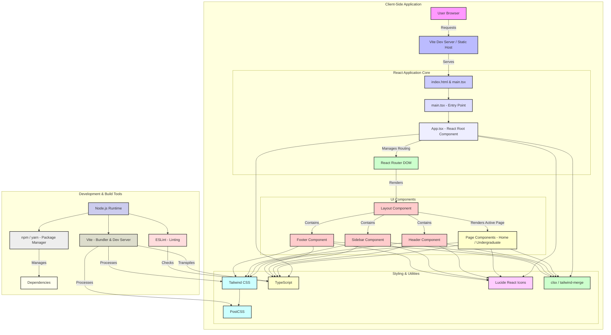
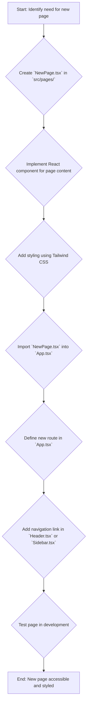

<!--
  Generated by AI-Powered README Generator
  Repository: https://github.com/penguince/csi-website-revamp
  Generated: 2025-12-02T15:53:40.451Z
  Format: md
  Style: comprehensive
-->

# 🚀 CSI Computer Science Department Website Recreation

**A modern, accessible, and high-performance redesign of the College of Staten Island Computer Science Department website.**

[](https://www.npmjs.com/package/csi-website-revamp)
[](https://www.typescriptlang.org/)
[](./LICENSE)
[](https://vitejs.dev/)
[](https://tailwindcss.com/)

---

## 🧭 Table of Contents

*   [Overview](#overview)
    *   [Purpose & Goals](#purpose--goals)
    *   [Why it Matters](#why-it-matters)
    *   [Target Audience](#target-audience)
*   [✨ Feature Highlights](#feature-highlights)
*   [🏗️ Architecture & Design](#architecture--design)
    *   [High-Level Component Diagram](#high-level-component-diagram)
    *   [Technology Stack](#technology-stack)
    *   [Core Modules & Responsibilities](#core-modules--responsibilities)
*   [🚀 Getting Started](#getting-started)
    *   [Prerequisites](#prerequisites)
    *   [Installation Steps](#installation-steps)
    *   [Configuration](#configuration)
    *   [Running the Application](#running-the-application)
*   [💡 Usage & Workflows](#usage--workflows)
    *   [Navigating the Site](#navigating-the-site)
    *   [Common Development Workflows](#common-development-workflows)
*   [🚧 Limitations, Known Issues & Future Roadmap](#limitations-known-issues--future-roadmap)
    *   [Current Limitations](#current-limitations)
    *   [Known Issues](#known-issues)
    *   [Future Roadmap](#future-roadmap)
*   [🤝 Contributing & Development Guidelines](#contributing--development-guidelines)
    *   [How to Contribute](#how-to-contribute)
    *   [Branching & Pull Request Guidelines](#branching--pull-request-guidelines)
    *   [Code Style & Linting](#code-style--linting)
*   [📜 License, Credits & Contact](#license-credits--contact)
    *   [License Information](#license-information)
    *   [Acknowledgments & Dependencies](#acknowledgments--dependencies)
    *   [Maintainer & Contact](#maintainer--contact)
*   [📚 Appendix](#appendix)
    *   [Changelog](#changelog)
    *   [Frequently Asked Questions (FAQ)](#frequently-asked-questions-faq)
    *   [Troubleshooting Guide](#troubleshooting-guide)

---

## <a id="overview"></a>✨ Overview

This project is a comprehensive recreation and modernization of the College of Staten Island's Computer Science Department website, originally found at [https://www.cs.csi.cuny.edu/](https://www.cs.csi.cuny.edu/). Leveraging modern web technologies, this revamp focuses on delivering an exceptional user experience with a strong emphasis on design, accessibility, and performance.

### <a id="purpose--goals"></a>🎯 Purpose & Goals

The primary goals of this project are:
*   **Modernization**: Replace outdated web technologies with a robust, scalable, and maintainable stack (React, TypeScript, Tailwind CSS).
*   **Accessibility**: Achieve WCAG AA compliance to ensure the website is usable by everyone, including individuals with disabilities.
*   **User Experience (UX)**: Provide a clean, intuitive, and responsive interface that works seamlessly across all devices (mobile, tablet, desktop).
*   **Performance**: Optimize loading times and responsiveness through efficient bundling with Vite.
*   **Maintainability**: Structure the codebase for easy updates, content management, and future expansions.

### <a id="why-it-matters"></a>💡 Why it Matters

In today's digital landscape, a modern and accessible online presence is crucial for academic institutions. This project addresses several key challenges with the original site:
*   **Outdated Aesthetics**: A fresh, contemporary design enhances the department's image and appeals to prospective students.
*   **Accessibility Gaps**: Ensures compliance with modern web standards, making information equally available to all users, preventing discrimination, and improving SEO.
*   **Poor Mobile Experience**: A fully responsive design caters to the growing number of users accessing websites via mobile devices.
*   **Performance Issues**: Faster load times lead to better user engagement and retention.

### <a id="target-audience"></a>👥 Target Audience

This application is designed for:
*   **Prospective Students**: Seeking information on programs, courses, faculty, and admissions.
*   **Current Students**: Accessing resources, course catalogs, faculty information, and academic support.
*   **Faculty & Staff**: Viewing departmental news, research areas, and program details.
*   **Researchers & Academics**: Exploring research projects and faculty profiles.
*   **General Public**: Anyone interested in the College of Staten Island's Computer Science Department.

[⬆️ Back to Top](#table-of-contents--navigation-links)

---

## <a id="feature-highlights"></a>✨ Feature Highlights

This revamped website offers a rich set of features designed to enhance usability and content delivery.

*   **🌐 Modern & Clean User Interface**:
    *   ✅ Fresh, intuitive, and aesthetically pleasing design.
    *   🚀 Seamless navigation with clear information hierarchy.
    *   🎨 Utilizes a consistent design system for visual harmony.
*   **♿ WCAG AA Accessibility Compliance**:
    *   ✅ Semantic HTML5 for screen reader compatibility.
    *   ✅ ARIA labels and landmarks for enhanced navigation.
    *   ✅ Keyboard-friendly interactions with visible focus indicators.
    *   ✅ High contrast color palette (WCAG AA) for readability.
    *   🔍 Comprehensive alt text for all images.
*   **📱 Fully Responsive Design**:
    *   ✅ Optimized layouts for mobile, tablet, and desktop screens.
    *   💡 Fluid grid system ensures content adapts gracefully.
    *   ⭐ Enhanced user experience across diverse devices.
*   **⚡ High Performance**:
    *   🚀 Built with Vite for incredibly fast development and production builds.
    *   ✅ Optimized for quick page loads and smooth transitions.
    *   💡 Client-side routing with React Router for snappy navigation without full page reloads.
*   **🧩 Component-Based Architecture**:
    *   ✅ Reusable React components (Header, Footer, Layout, Sidebar).
    *   🔍 Modular design for easy maintenance and scalability.
    *   ⭐ Dedicated page components for each section (Home, Undergraduate, Graduate, etc.).
*   **🛠️ Robust Tech Stack**:
    *   ✅ Developed with React 19.1.1 and TypeScript 5.9.3 for strong typing and developer productivity.
    *   ✅ Styled with Tailwind CSS 3.x for rapid, utility-first styling.
    *   ✅ Icons provided by Lucide React for a consistent visual language.

[⬆️ Back to Top](#table-of-contents--navigation-links)

---

## <a id="architecture--design"></a>🏗️ Architecture & Design

The application is built using a modern client-side architecture, emphasizing modularity, performance, and maintainability.

### <a id="high-level-component-diagram"></a>Diagram: High-Level Component Overview

The following diagram illustrates the primary components and their interactions within the application.



### <a id="technology-stack"></a>Tech Stack Breakdown

The application is built upon a robust and modern set of technologies:

*   **Frontend Framework**: [React 19.1.1](https://react.dev/)
    *   A declarative, component-based JavaScript library for building user interfaces.
*   **Language**: [TypeScript 5.9.3](https://www.typescriptlang.org/)
    *   A superset of JavaScript that adds static types, enhancing code quality and maintainability.
*   **Build Tool & Dev Server**: [Vite (Rolldown-Vite 7.1.14)](https://vitejs.dev/)
    *   A next-generation frontend tool that provides incredibly fast development server startup and optimized production builds.
*   **Styling**: [Tailwind CSS 3.x](https://tailwindcss.com/)
    *   A utility-first CSS framework that enables rapid UI development directly in your markup.
*   **Routing**: [React Router DOM 7.x](https://reactrouter.com/en/main)
    *   Standard library for routing in React applications, enabling client-side navigation.
*   **Icons**: [Lucide React](https://lucide.dev/packages/lucide-react)
    *   A collection of customizable SVG icons for React projects.
*   **Utilities**: `clsx`, `tailwind-merge`
    *   `clsx`: A tiny utility for constructing `className` strings conditionally.
    *   `tailwind-merge`: Helps resolve Tailwind CSS class conflicts programmatically.
*   **Linting**: [ESLint](https://eslint.org/) with `typescript-eslint`
    *   Static code analysis tool to enforce code style and identify potential issues.
*   **Package Manager**: `npm`

### <a id="core-modules--responsibilities"></a>Core Modules & Responsibilities

The project follows a clear modular structure for better organization and separation of concerns:

*   **`src/main.tsx`**:
    *   The primary entry point of the React application. It mounts the `App` component into the `index.html` DOM.
*   **`src/App.tsx`**:
    *   The root component that sets up the React Router for client-side navigation. It defines all the main routes and renders the `Layout` component.
*   **`src/components/`**:
    *   Contains reusable UI components shared across different pages, such as `Header.tsx` (main navigation), `Footer.tsx` (site-wide footer), `Sidebar.tsx` (secondary navigation/side menu), and `Layout.tsx` (a wrapper component providing a consistent structure for pages).
*   **`src/pages/`**:
    *   Each file in this directory represents a distinct page of the website (e.g., `Home.tsx`, `Undergraduate.tsx`, `Faculty.tsx`). These components fetch and display the content specific to their respective sections.
*   **`src/index.css`**:
    *   Global styles, including Tailwind CSS imports and any custom base styles.
*   **`tailwind.config.js`**:
    *   Tailwind CSS configuration file, defining custom colors (`csi-blue`, `csi-dark`, `csi-gray`), theme extensions, and plugins.
*   **`vite.config.ts`**:
    *   Vite configuration file, handling build options, development server settings, and React-specific plugins.

[⬆️ Back to Top](#table-of-contents--navigation-links)

---

## <a id="getting-started"></a>🚀 Getting Started

Follow these steps to get a local copy of the project up and running for development and testing.

### <a id="prerequisites"></a>📋 Prerequisites

Ensure you have the following software installed on your machine:

*   **Node.js**: `v18` or higher (recommended `v20.x`)
    *   [Download Node.js](https://nodejs.org/en/download/)
*   **npm**: Included with Node.js, or [Yarn](https://yarnpkg.com/en/docs/install) (if preferred)

You can verify your Node.js and npm versions using:

```bash
node -v
npm -v
```

### <a id="installation-steps"></a>⚙️ Installation Steps

1.  **Clone the repository**:
    ```bash
    git clone https://github.com/penguince/csi-website-revamp.git
    cd csi-website-revamp
    ```

2.  **Install dependencies**:
    ```bash
    npm install
    # or
    yarn install
    ```

### <a id="configuration"></a>🛠️ Configuration

The project uses several configuration files. Most development tasks won't require direct modification of these, but it's good to be aware of their purpose:

*   **`tailwind.config.js`**:
    *   Defines the custom color palette (`csi-blue`, `csi-dark`, `csi-gray`) and other Tailwind CSS specific settings.
    *   **💡 Tip**: If you introduce new custom colors or want to enable new Tailwind plugins, this is the file to edit.
*   **`vite.config.ts`**:
    *   Manages Vite's build process and development server. Includes the React plugin.
    *   **💡 Tip**: For advanced scenarios like proxying API requests (not currently used), configuring build outputs, or adding other Vite plugins, you'd modify this file.
*   **`tsconfig.json`**, `tsconfig.app.json`, `tsconfig.node.json`:
    *   TypeScript configuration files that define compiler options, type checking rules, and project references.
    *   **🔍 Note**: Ensure your IDE is using these `tsconfig` files for proper TypeScript IntelliSense and error checking.

### <a id="running-the-application"></a>🚀 Running the Application

#### Development Mode

To start the development server with hot-reloading:

```bash
npm run dev
# or
yarn dev
```

The application will typically be available at `http://localhost:5174/` (or another port if 5174 is in use). Check your terminal for the exact URL.

#### Building for Production

To create an optimized production build:

```bash
npm run build
# or
yarn build
```

This command compiles the TypeScript code, bundles the assets with Vite, and places the optimized output (HTML, CSS, JavaScript) into the `dist/` directory.

#### Previewing the Production Build

To locally serve and test the production build:

```bash
npm run preview
# or
yarn preview
```

This will start a local static server to serve the contents of the `dist/` folder, allowing you to see how the optimized application behaves before deployment.

[⬆️ Back to Top](#table-of-contents--navigation-links)

---

## <a id="usage--workflows"></a>💡 Usage & Workflows

This section covers how users interact with the deployed application and common development workflows.

### <a id="navigating-the-site"></a>Navigating the Site

The application uses client-side routing, meaning navigation between pages is fast and doesn't require a full page reload.

*   **Main Navigation**:
    *   The `Header.tsx` component provides the primary navigation links to key sections like Home, Undergraduate, Graduate, Courses, Research, Faculty, and Resources.
    *   On smaller screens, a responsive menu (often a hamburger icon) will appear to toggle the navigation.
*   **Sidebar Navigation**:
    *   The `Sidebar.tsx` component (if active) offers additional or contextual navigation links, enhancing discoverability.
*   **Internal Links**:
    *   Content within pages may contain internal links to other sections or specific points on a page.

### <a id="common-development-workflows"></a>Common Development Workflows

#### Diagram: Adding a New Page

This flowchart illustrates the typical steps involved in creating and integrating a new content page into the website.



#### Adding a New Page

<details>
<summary>Click to expand detailed steps</summary>

1.  **Create the Page Component**:
    *   Inside `src/pages/`, create a new `.tsx` file (e.g., `Events.tsx`).
    *   Define your React component with the page's content.

    ```tsx
    // src/pages/Events.tsx
    import React from 'react';

    const Events: React.FC = () => {
        return (
            <div className="container mx-auto p-4">
                <h1 className="text-3xl font-bold text-csi-dark mb-4">Upcoming Events</h1>
                <p className="text-lg text-gray-700">Check back soon for exciting events from the CS Department!</p>
                {/* Add more event details here */}
            </div>
        );
    };

    export default Events;
    ```

2.  **Define the Route in `App.tsx`**:
    *   Open `src/App.tsx`.
    *   Import your new page component.
    *   Add a new `<Route>` element within `<Routes>`.

    ```tsx
    // src/App.tsx
    import { BrowserRouter as Router, Routes, Route } from 'react-router-dom';
    import Layout from './components/Layout';
    import Home from './pages/Home';
    // ... other page imports
    import Events from './pages/Events'; // Import your new page

    function App() {
        return (
            <Router>
                <Layout>
                    <Routes>
                        <Route path="/" element={<Home />} />
                        {/* ... other routes */}
                        <Route path="/events" element={<Events />} /> {/* Add the new route */}
                    </Routes>
                </Layout>
            </Router>
        );
    }

    export default App;
    ```

3.  **Add Navigation Link**:
    *   Open `src/components/Header.tsx` or `src/components/Sidebar.tsx`.
    *   Add a `<NavLink>` to your new page.

    ```tsx
    // src/components/Header.tsx (example)
    import { NavLink } from 'react-router-dom';
    // ...
    <nav className="flex space-x-4">
        <NavLink to="/" className={({ isActive }) => (isActive ? 'font-bold text-csi-blue' : 'hover:text-csi-blue')}>Home</NavLink>
        {/* ... other links */}
        <NavLink to="/events" className={({ isActive }) => (isActive ? 'font-bold text-csi-blue' : 'hover:text-csi-blue')}>Events</NavLink>
    </nav>
    ```

4.  **Test**:
    *   Run `npm run dev`.
    *   Navigate to the new route (`http://localhost:5174/events`) and click the new navigation link to ensure everything works correctly.

</details>

#### Modifying Styles

The project uses Tailwind CSS for styling. This means most styles are applied directly in the JSX via class names.

<details>
<summary>Click to expand detailed styling guidance</summary>

1.  **Utility-First Approach**:
    *   Apply classes like `text-csi-dark`, `p-4`, `flex`, `md:text-lg` directly to your HTML elements.
    *   **💡 Tip**: Use Tailwind's documentation ([tailwindcss.com/docs](https://tailwindcss.com/docs)) to find the appropriate utility classes.

2.  **Custom Colors**:
    *   The `tailwind.config.js` defines custom colors like `csi-blue`, `csi-dark`, `csi-gray`.
    *   Use them like any other Tailwind color: `bg-csi-blue`, `text-csi-dark`.

3.  **Responsive Design**:
    *   Use responsive prefixes (`sm:`, `md:`, `lg:`) to apply styles conditionally based on screen size.
    *   Example: `<div className="w-full md:w-1/2">` means the div takes full width on small screens, and half width on medium screens and up.

4.  **Global Styles**:
    *   `src/index.css` is where you can define global CSS, import Tailwind directives, or add custom CSS for elements that can't be styled effectively with utilities.
    *   **⚠️ Warning**: Try to keep global CSS to a minimum and prefer Tailwind utilities for consistency.

</details>

[⬆️ Back to Top](#table-of-contents--navigation-links)

---

## <a id="limitations-known-issues--future-roadmap"></a>🚧 Limitations, Known Issues & Future Roadmap

### <a id="current-limitations"></a>Current Limitations

*   **Static Content**: The current version relies on static content embedded directly within React components. There is no backend integration or CMS.
*   **No Data Fetching**: Data (e.g., faculty lists, course descriptions) is hardcoded.
*   **No Search Functionality**: The website does not currently include a search bar or indexing for content.
*   **Basic Forms**: Any interactive forms would require backend integration, which is not present.

### <a id="known-issues"></a>Known Issues

*   None critical identified at this stage. Please report any bugs or unexpected behavior via the contact information provided.

### <a id="future-roadmap"></a>🚀 Future Roadmap

This project lays a strong foundation for future enhancements:

1.  **Dynamic Content & API Integration**:
    *   Integrate with a headless CMS (e.g., Strapi, Contentful) or a custom backend API to manage content dynamically (pages, faculty, courses, events, news).
    *   Implement data fetching strategies (e.g., React Query, SWR) for efficient data management.
2.  **Search Functionality**:
    *   Add a site-wide search feature, potentially using a library like Algolia or a custom backend search.
3.  **User Authentication (Admin Panel)**:
    *   Develop an admin interface for content editors to manage website content.
    *   Implement authentication and authorization mechanisms.
4.  **Enhanced Faculty & Staff Profiles**:
    *   Detailed profiles with publications, research interests, contact forms, etc.
5.  **Interactive Course Catalog**:
    *   Filtering, sorting, and more detailed views for courses.
6.  **Events Management System**:
    *   Dynamic display of upcoming events, potentially with registration features.
7.  **Performance Audits**:
    *   Further optimization based on Lighthouse scores and real user monitoring.
8.  **Full Accessibility Audit**:
    *   Run advanced accessibility tools (e.g., axe-core, manual testing) to ensure maximum compliance.

[⬆️ Back to Top](#table-of-contents--navigation-links)

---

## <a id="contributing--development-guidelines"></a>🤝 Contributing & Development Guidelines

Contributions are welcome! If you're interested in improving this project, please follow these guidelines.

### <a id="how-to-contribute"></a>How to Contribute

1.  **Fork the repository**: Click the "Fork" button at the top right of the GitHub page.
2.  **Clone your forked repository**:
    ```bash
    git clone https://github.com/YOUR_GITHUB_USERNAME/csi-website-revamp.git
    cd csi-website-revamp
    ```
3.  **Create a new branch**:
    ```bash
    git checkout -b feature/your-feature-name
    # or
    git checkout -b bugfix/issue-description
    ```
4.  **Make your changes**: Implement your features or bug fixes.
5.  **Test your changes**: Ensure your code works as expected and doesn't introduce new issues.
6.  **Commit your changes**: Write clear and concise commit messages.
    ```bash
    git commit -m "feat: Add new events page"
    # or
    git commit -m "fix: Resolve accessibility issue with navigation"
    ```
7.  **Push your branch**:
    ```bash
    git push origin feature/your-feature-name
    ```
8.  **Create a Pull Request (PR)**:
    *   Go to your forked repository on GitHub and click "New pull request".
    *   Provide a clear title and description for your PR, explaining the changes you've made.
    *   Reference any related issues.

### <a id="branching--pull-request-guidelines"></a>Branching & Pull Request Guidelines

*   **Branch Naming**: Use descriptive names like `feature/add-search`, `bugfix/fix-mobile-header`, `refactor/component-x`.
*   **Commit Messages**: Follow a conventional commit style (e.g., `feat:`, `fix:`, `docs:`, `chore:`, `refactor:`).
*   **Pull Requests**:
    *   Keep PRs focused on a single feature or bug fix.
    *   Ensure all tests pass and linting checks are green.
    *   Provide screenshots or GIFs for UI changes.
    *   Be open to feedback and collaborate during the review process.

### <a id="code-style--linting"></a>Code Style & Linting

*   **ESLint**: The project uses ESLint with TypeScript and React plugins to enforce code quality and style.
    *   You can run the linter manually: `npm run lint`
    *   **💡 Tip**: Most IDEs (like VS Code) have extensions that integrate ESLint, providing real-time feedback.
*   **TypeScript**: Adhere to strict TypeScript typing.
*   **Tailwind CSS**: Follow Tailwind's utility-first philosophy. Avoid writing custom CSS unless absolutely necessary.
*   **React Best Practices**:
    *   Keep components small and focused.
    *   Use functional components and React Hooks.
    *   Prefer prop drilling over context for simple data flows; use Context API for global state.

[⬆️ Back to Top](#table-of-contents--navigation-links)

---

## <a id="license-credits--contact"></a>📜 License, Credits & Contact

### <a id="license-information"></a>License Information

This project is created as part of an academic assignment for the CSI Computer Science Department. As such, it is provided under an **Academic Assignment License**. This implies:

*   The code is primarily for educational purposes and demonstration.
*   Use and modification should respect the academic context.
*   For specific commercial or broader open-source use, explicit permission or clarification would be required from the project creator.

### <a id="acknowledgments--dependencies"></a>Acknowledgments & Dependencies

We extend our gratitude to:

*   **College of Staten Island Computer Science Department**: For the inspiration and context of this project.
*   **Original Website**: [https://www.cs.csi.cuny.edu/](https://www.cs.csi.cuny.edu/)
    *   This project is a recreation and does not replace the official CSI Computer Science website.
*   **Open Source Community**: For the incredible tools and libraries that make modern web development possible.

**Key Dependencies**:
*   `react`, `react-dom`
*   `react-router-dom`
*   `clsx`, `tailwind-merge`
*   `lucide-react`
*   `@radix-ui/react-icons`

**Key Dev Dependencies**:
*   `typescript`
*   `vite` (rolldown-vite)
*   `tailwindcss`, `postcss`, `autoprefixer`
*   `eslint`, `typescript-eslint`, `eslint-plugin-react-hooks`, `eslint-plugin-react-refresh`

### <a id="maintainer--contact"></a>Maintainer & Contact

*   **Developer & Designer**: [Your Name]
*   **Email**: [your-email@example.com]
*   **GitHub**: [https://github.com/penguince](https://github.com/penguince)

For any questions, feedback, or suggestions, please feel free to reach out.

[⬆️ Back to Top](#table-of-contents--navigation-links)

---

## <a id="appendix"></a>📚 Appendix

### <a id="changelog"></a>Changelog

<details>
<summary>Click to expand Changelog</summary>

**v0.0.0 - Initial Release (YYYY-MM-DD)**
*   Initial development of core website structure.
*   Implemented React, TypeScript, Tailwind CSS, and Vite.
*   Created core components: Header, Footer, Layout, Sidebar.
*   Developed main pages: Home, Undergraduate, Graduate, Courses, Research, Faculty, Resources.
*   Integrated React Router DOM for client-side navigation.
*   Ensured basic responsiveness and accessibility features.
*   Setup linting with ESLint.

</details>

### <a id="frequently-asked-questions-faq"></a>Frequently Asked Questions (FAQ)

<details>
<summary>Q: How do I add new content to an existing page?</summary>
A: For existing pages, you'll need to directly edit the corresponding `.tsx` file in `src/pages/`. Locate the section you want to modify and update the JSX content. Remember to save your changes, and Vite's HMR (Hot Module Replacement) will update your browser instantly in development mode.
</details>

<details>
<summary>Q: Can I change the color scheme?</summary>
A: Yes! The primary colors are defined in `tailwind.config.js`. You can modify the values for `csi-blue`, `csi-dark`, `csi-gray`, or add new custom colors. After saving, Tailwind CSS will regenerate its utility classes, and your application will reflect the new colors.
</details>

<details>
<summary>Q: Why did you choose Vite over Webpack or Create React App?</summary>
A: Vite was chosen for its superior developer experience, significantly faster cold start times, and instant hot module replacement (HMR) thanks to its use of native ES modules. It provides a more modern and performant build setup compared to traditional bundlers like Webpack, especially for development.
</details>

<details>
<summary>Q: Is there a backend for this application?</summary>
A: No, this is a purely frontend application. All content is currently static and embedded within the React components. Future plans include integrating with a backend or headless CMS for dynamic content.
</details>

### <a id="troubleshooting-guide"></a>Troubleshooting Guide

<details>
<summary>Q: `npm install` fails or encounters errors.</summary>
A:
1.  **Check Node.js Version**: Ensure your Node.js version meets the `v18` or higher requirement.
2.  **Clear Cache**: Try clearing your npm cache: `npm cache clean --force` then retry `npm install`.
3.  **Delete `node_modules`**: Remove the `node_modules` directory and `package-lock.json` (or `yarn.lock`), then run `npm install` again.
4.  **Network Issues**: Check your internet connection, as `npm install` downloads packages from the registry.
</details>

<details>
<summary>Q: `npm run dev` doesn't start or shows an error.</summary>
A:
1.  **Dependencies Installed?**: Ensure you've run `npm install` successfully.
2.  **Port Conflict**: If the default port (`5174`) is in use, Vite will usually suggest another one. Check your terminal output. If you explicitly want to change it, you can configure it in `vite.config.ts`.
3.  **Syntax Errors**: Check your recent code changes for any TypeScript or JavaScript syntax errors. The terminal output will usually point to the problematic file and line number.
4.  **Corrupted `node_modules`**: Try deleting `node_modules` and `package-lock.json` (or `yarn.lock`), then `npm install` and `npm run dev` again.
</details>

<details>
<summary>Q: Tailwind CSS styles are not applying.</summary>
A:
1.  **Check `tailwind.config.js` `content`**: Ensure that the `content` array in `tailwind.config.js` correctly includes all paths where you use Tailwind classes (`./index.html`, `./src/**/*.{js,ts,jsx,tsx}`).
2.  **Import in `index.css`**: Verify that `@tailwind` directives are correctly imported in `src/index.css`:
    ```css
    @tailwind base;
    @tailwind components;
    @tailwind utilities;
    ```
3.  **Rebuild/Restart Dev Server**: Sometimes, Tailwind's JIT mode needs a restart (`npm run dev`) to pick up new configurations or classes.
</details>

[⬆️ Back to Top](#table-of-contents--navigation-links)
